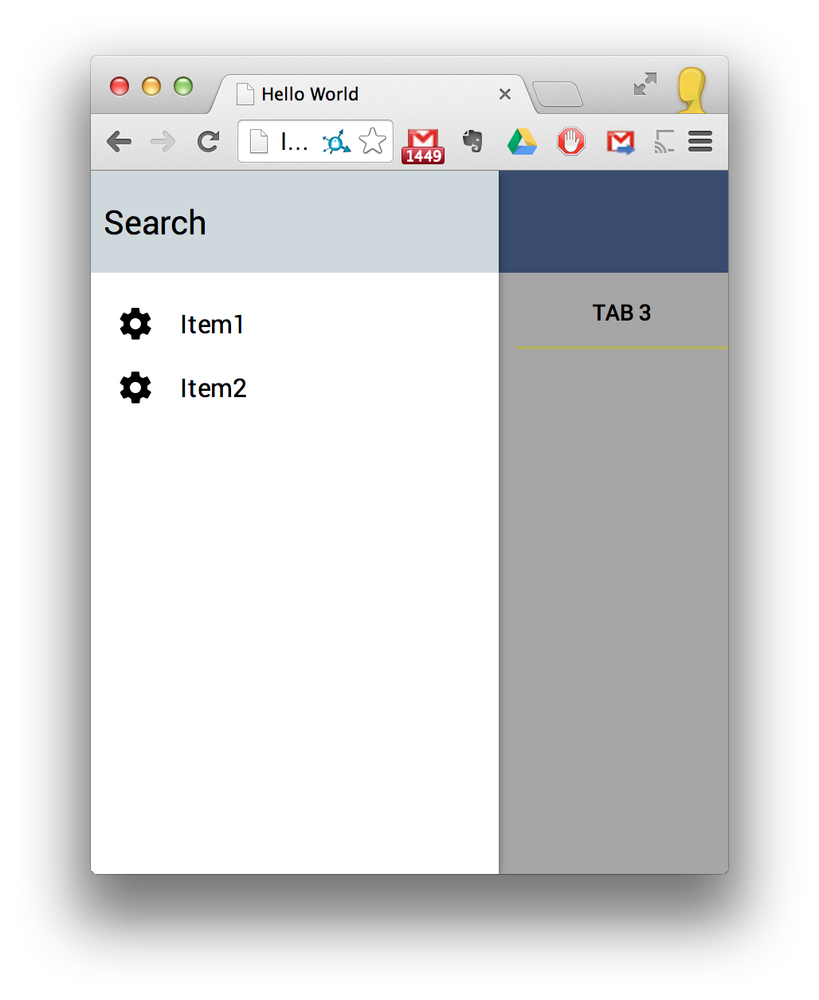
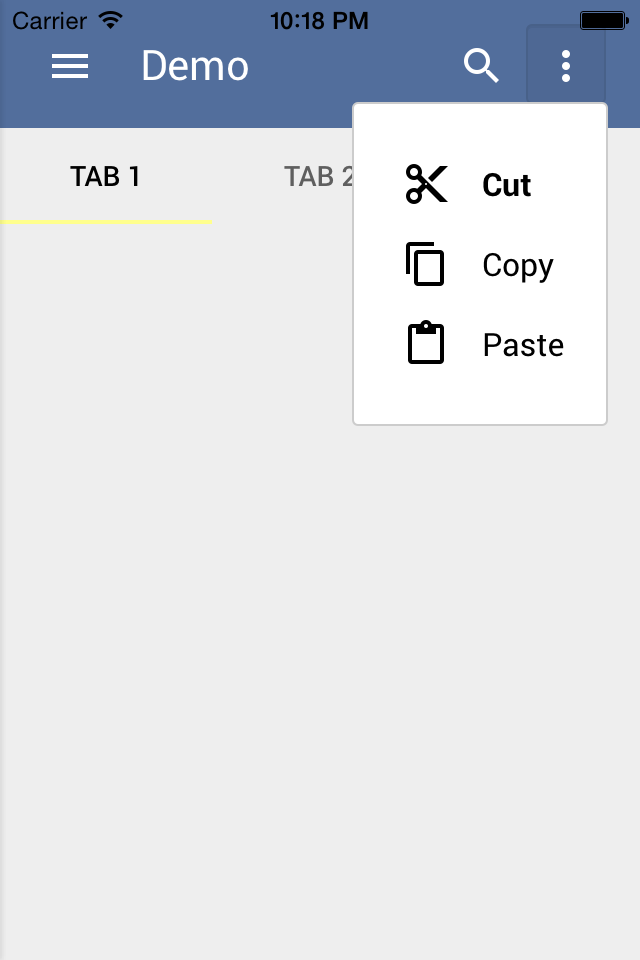
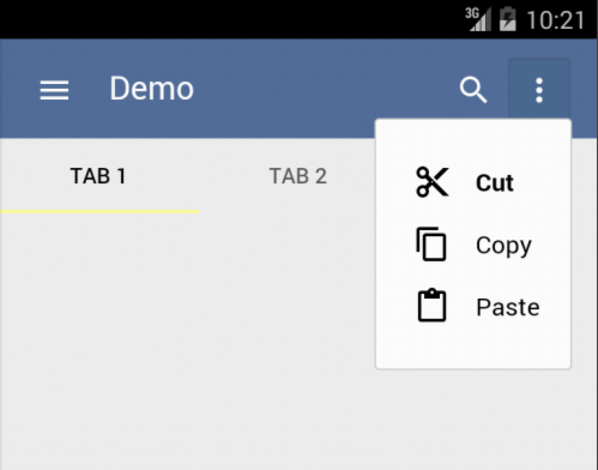

Generic Cordova Polymer Application
===================================

This is a generic app framework with polymer ui elements that can run as a
standalone webpage, an android app, or an ios app.  

Features
--------

This demo provides basic application scaffolding using polymer.

In addition to

How to use this repo
--------------------

1. Clone this repo and delete the .git directory
2. Update the application name in bower.json and package.json
3. Follow the steps below to get the boilerplate app working.

First time Setup
----------------

### Setting up tools

1. run ``npm install -g yo`` to install yo, grunt-cli and bower
2. run ``npm install -g cordova`` to install the cordova mobile utility
3. run ``export PATH=/usr/local/share/npm/bin:$PATH`` to ensure command line
access to modules.

### Setting up the repo after cloning for the first time

1. run ``npm install`` to initialize node modules
2. run ``bower install`` to initialize bower dependencies
3. run ``grunt build`` to build the "dist" directory
4. run ``grunt cordova`` to build the cordova directory

### Copying settings to android and ios app

Run this the first time, and any time after you make modifications to the ``app``
directory.

1. run ``grunt cordova`` to initialize the platforms directory with ios and
android applications

Standalone web app
------------------

### Running the web application

1. grunt serve --platform=ios

Android
-------

### Running the android app

The android app can be run in an emulator, which can be installed with brew

1. run ``brew install android`` to install the android toolkig
2. run ``android`` to download packages and set up an avd device.

To run the android on an emulator or connected device

1. Attach an android device in debug mode, or run the android avd emulator.
2. if you are running on a connected device you can verify first with ``adb devices``
3. ``cd cordova``
4. run ``cordova run android``

### Debugging the android app

TODO

IOS
---

### Running the ios app

The ios app can be run in an emulator, which can be installed via xcode.  It can
only be installed on devices with a valid provisioning profile, which requires a
paid apple developer account.

To run on a emulator

1. ``cd cordova``
2. run ``cordova emulate ios``

To run on a connected device (requires provisioning)

1. run ``cordova run ios``

### Debugging the ios app

1. Run Xcode
2. Open ``./platforms/ios/*.xcodeproj``
3. Click Run

### Debugging the ios app in safari

1. At the command line run ``defaults write com.apple.Safari IncludeDebugMenu 1``
(you only need to do this once)
2. Launch the app in the emulator
3. Launch safari
4. Connect to the Iphone Simulator in the Develop menu

Extending the application
-------------------------

### adding new javascript dependencies

1. Find a module with ``bower search <search term>``
2. Install it and save it to your bower.json file with ``bower install <javascript module> --save``

File documentation
------------------
### Project files

* **``README.md``** This file
* **``bower.json``** A list of all json dependencies.  _Do not modify directly_.  
Add new dependencies with ``bower install <dependency name> --save``
* **``app/``** All of the actual content of the app is contained in this directory

### Files not kept in version control

* ``dist/*`` Stores the intermediate minified and cleaned files before they are compiled to cordova
* ``cordova/*`` Stores the generated cordova applications for ios and android
* ``node_modules/*`` These files are generaetd by npm install
* ``app/bower_components/*`` These files are generated by bower install
